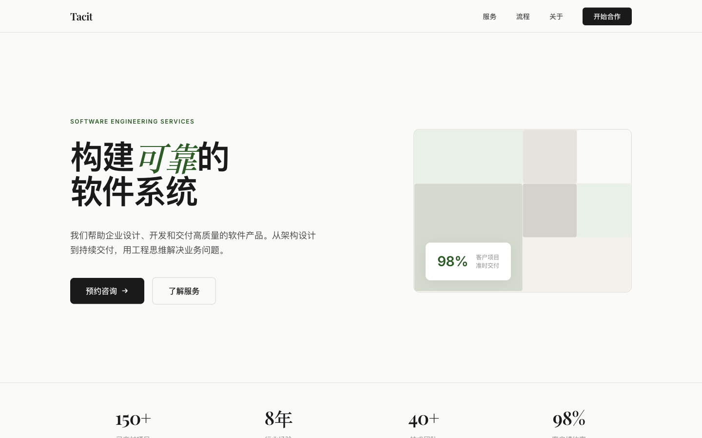

<div align="center">

# polanyi-design

> *"We can know more than we can tell."*
> — Michael Polanyi, *The Tacit Dimension* (1966)

[](LICENSE)
[](https://claude.ai/code)

**A frontend design cognitive engine** that surfaces the visual judgment<br>
senior designers *know* but rarely articulate.

Not a role-play. Not a template generator.<br>
An operational thinking system grounded in tacit knowledge theory.

[Install](#-install) · [See the Difference](#-see-the-difference) · [How It Works](#-how-it-works) · [Measured Impact](#-measured-impact) · [Credits](#credits)

<br>

**Same prompt. Different design intelligence.**

| Without Skill | With polanyi-design |
|:---:|:---:|
|  |  |
| Blue gradients, centered everything, Inter | Deep green, Playfair+Inter pairing, 60/40 editorial split |

> Both pages generated from the identical prompt: *"设计一个软件服务公司的 landing page"*<br>
> [Live baseline](https://sunflowerslwtech.github.io/polanyi-design/showcase/landing-baseline.html) · [Live enhanced](https://sunflowerslwtech.github.io/polanyi-design/showcase/landing-enhanced.html) · [Side-by-side comparison](https://sunflowerslwtech.github.io/polanyi-design/showcase/index.html)

</div>

---

## 📦 Install

### Method 1: Global (works across all projects)

```bash
mkdir -p ~/.claude/skills/polanyi-design

curl -o ~/.claude/skills/polanyi-design/SKILL.md \
  https://raw.githubusercontent.com/SunflowersLwtech/polanyi-design/main/SKILL.md
```

### Method 2: Project-local (this repo only)

```bash
mkdir -p .claude/skills/polanyi-design

curl -o .claude/skills/polanyi-design/SKILL.md \
  https://raw.githubusercontent.com/SunflowersLwtech/polanyi-design/main/SKILL.md
```

### Method 3: Manual

1. Download [SKILL.md](SKILL.md)
2. Place it at `~/.claude/skills/polanyi-design/SKILL.md` (global) or `.claude/skills/polanyi-design/SKILL.md` (project)

### Usage

Once installed, invoke directly:

```
/polanyi-design 设计一个登录页面
```

Or let it auto-activate when you ask design-related questions — the skill triggers on keywords like "design", "layout", "UI", "looks like a template", "feels off", etc.

### Verify Installation

```bash
cat ~/.claude/skills/polanyi-design/SKILL.md | head -5
# Should show: ---
#              name: polanyi-design
```

---

## 👁 See the Difference

> **Same prompt, same model. One with the skill loaded, one without.**

### Prompt: *"设计一个软件服务公司的 landing page"*

Both pages were generated in fresh Claude Code sessions with **identical prompts**.
The only difference: one session had `polanyi-design` loaded.

**[View Baseline (no skill)](https://sunflowerslwtech.github.io/polanyi-design/showcase/landing-baseline.html)** · **[View Enhanced (with skill)](https://sunflowerslwtech.github.io/polanyi-design/showcase/landing-enhanced.html)**

<table>
<tr>
<th width="50%">❌ Without Skill — 648 lines</th>
<th width="50%">✅ With polanyi-design — 1058 lines</th>
</tr>
<tr>
<td>

**No design thesis.** Jumps straight to code.

**Generic palette**: Blue gradients, standard SaaS look

**Font**: System defaults

**Hero**: 居中标题 + 双按钮 CTA + 渐变背景

**Services**: 6 等宽卡片网格

**Testimonials**: 3 条并排五星评价

**Layout**: 居中对齐一切，均匀间距

**Accessibility**: 未提及

</td>
<td>

**Declares design thesis first:**<br>
*"Editorial Technical — 杂志般的排版节奏 + 工程师的精确感"*

**Anti-template decisions:**<br>
*"不用蓝色。选了深植物绿 #2d5a27 — 传递'有机生长'而非'又一个SaaS'"*

**Font**: Playfair Display (衬线) + Inter (无衬线) — 编辑杂志感

**Hero**: 60/40 分割，斜体衬线 + 无衬线混排制造视觉张力

**Services**: 大号编号 01/02/03 低透明度 — 给节奏不抢内容

**Testimonials**: *"只放一条 — 一个好引言比三个平庸的更有力"*

**Layout**: 每处都有一个主次关系，非对称

**Accessibility**: `prefers-reduced-motion`, `:focus-visible`, 语义化 HTML

</td>
</tr>
</table>

### Key Design Decisions Only the Skill Produces

| Decision | Why It Matters |
|----------|---------------|
| **不用蓝色，用深植物绿** | 蓝色是 SaaS 模板的统计众数。偏离默认 = 有观点 |
| **衬线 + 无衬线混排** | 单一字体 = 模板。有对比的字体搭配 = 设计系统 |
| **Hero 60/40 分割** | 50/50 读起来像犹豫不决，60/40 读起来像有意为之 |
| **Testimonial 只放一条** | Skill 的默会判断：一条有力的 > 三条平庸的 |
| **声明设计论点再写代码** | 没有论点的设计 = 无意识的默认值堆积 |

### Fashion Brand Demo

Also included: a luxury fashion website (NOIR ATELIER) with the same A/B methodology:

**[View Baseline](https://sunflowerslwtech.github.io/polanyi-design/showcase/demo-baseline.html)** · **[View Enhanced](https://sunflowerslwtech.github.io/polanyi-design/showcase/demo-enhanced.html)**

| Without Skill | With Skill |
|---|---|
| 黑底白字，居中一切，Inter字体，均匀3列网格 | 暖白色调，Fibonacci间距，描边建筑字体，非对称分割，token层级 |

---

## 🧠 How It Works

Three systems fire in sequence:

### System 1: Knowledge Filter

```
┌─────────────────────────────────┐
│  SKIP (Explicit)                │  Don't restate Tailwind docs.
├─────────────────────────────────┤
│  EXTRACT (Implicit) ★          │  Senior designer reasoning.
│  This is where you spend tokens │  The unspoken "why."
├─────────────────────────────────┤
│  PUSH (Tacit)                   │  "This feels off" → structural
│  Embodied · Holistic · Context  │  diagnosis + concrete fix.
└─────────────────────────────────┘
```

### System 2: Five Design Lenses + Cross-Cutting

| Lens | What It Does |
|------|-------------|
| **Gestalt First** | Perceive the whole before parts. "Feels off" = gestalt failure. |
| **Subsidiary-Focal** | Design system should be invisible. Content is what you look AT. |
| **Token Hierarchy** | Raw → Semantic → Component. Good tokens ≠ good design. |
| **Tacit Translation** | "Feels cramped" → content-to-whitespace ratio → increase padding 1.5x |
| **Convention Judgment** | Know WHY rules exist. Break with rationale. |

**Cross-Cutting**: Accessibility (focus-visible, contrast AA, reduced-motion) · Motion System (duration scale, easing, choreography) · Data Visualization Colors (categorical, sequential, divergent, colorblind-safe) · Quality Verification (axe-core, 200% zoom, VoiceOver)

### Aesthetic Judgment Encoding

Six patterns from [frontend-design research](references/CREDITS.md):

1. **Negation > Assertion** — Ban defaults (Inter, shadow-md, rounded-lg) rather than prescribing "good taste"
2. **Polarization > Compromise** — Commit to "brutally minimal" or "maximalist editorial." The middle is where templates live.
3. **Intentionality > Intensity** — "What makes this UNFORGETTABLE?" beats "What follows best practices?"
4. **Anti-Convergence** — Prevent AI from reproducing the same safe choices every time
5. **Taxonomy > Rules** — Aesthetic directions (editorial, brutalist, organic) instead of fixed rules
6. **Multi-Layer Refinement** — Direction → Domain → Tactic → Negation, all coherent

### System 3: Output Protocol

```
[1-sentence design thesis — declared before any code]
[Concrete implementation — px, hex, font names]
[Tacit rationale — why, not just what]
[What NOT to do — prevents the most likely wrong choice]
[Escape hatch — when this advice shouldn't apply]
```

---

## 📊 Measured Impact

Evaluated via **A/B testing** across 5 design prompts (landing page diagnosis, dashboard layout,
token architecture, component API review, responsive strategy), each scored on 5 dimensions
(0-10 scale) by an independent Claude evaluator agent. The evaluator received both responses
without knowing which had the skill loaded. 3 rounds of iteration, self-evaluated — take
scores as directional, not peer-reviewed:

| Dimension | Avg Improvement |
|-----------|:--------------:|
| Technical Correctness | **+1.6** |
| Design Quality | **+1.6** |
| Depth of Reasoning | **+2.0** |
| Actionability | **+1.6** |
| **Tacit Articulation** | **+2.8** |
| **Overall** | **+30%** |

```
R1  ████████████████████████░░░░░░░░░░░░░░░░  +23%  (AC regression found)
R2  ████████████████████████████████░░░░░░░░░  +31%  (AC fixed, +3.0 swing)
R3  ███████████████████████████████░░░░░░░░░░  +30%  (production ready)
```

---

## Theoretical Foundation

Built on **Michael Polanyi's tacit knowledge framework** (1958-1966), operationalized through:

| Researcher | Contribution | How We Use It |
|-----------|-------------|--------------|
| **Michael Polanyi** | Subsidiary-focal awareness, indwelling, tacit knowing | Core lenses for design analysis |
| **Dreyfus Brothers** | 5-stage skill acquisition | Calibrate advice depth to user level |
| **Harry Collins** | Tacit knowledge taxonomy (relational/somatic/collective) | What AI can extract vs what needs practice |
| **Gestalt Psychology** | Figure-ground, proximity, continuity, closure | Visual design diagnostics |

---

## Credits

This is an **original work**, not a fork. We gratefully acknowledge:

- **[enzyme2013/polanyi-skill](https://github.com/enzyme2013/polanyi-skill)** — First public Polanyi skill, built with [nuwa-skill](https://github.com/alchaincyf/nuwa-skill)
- **[Google Design MD (Stitch)](https://stitch.withgoogle.com/docs/design-md/format)** — Structured design system spec format
- **Michael Polanyi** — *Personal Knowledge* (1958), *The Tacit Dimension* (1966)
- **The Polanyi Society** — [polanyisociety.org](https://polanyisociety.org/)

See [references/CREDITS.md](references/CREDITS.md) for full attribution.

---

## License

MIT License — See [LICENSE](LICENSE) for full text.

---

<div align="center">

*The easier knowledge is to codify, the less valuable restating it becomes.*<br>
*This skill operates where documentation ends and judgment begins.*

<br>

**[View Live Demos](https://sunflowerslwtech.github.io/polanyi-design/showcase/)** · **[SKILL.md](SKILL.md)** · **[Full Credits](references/CREDITS.md)**

</div>
